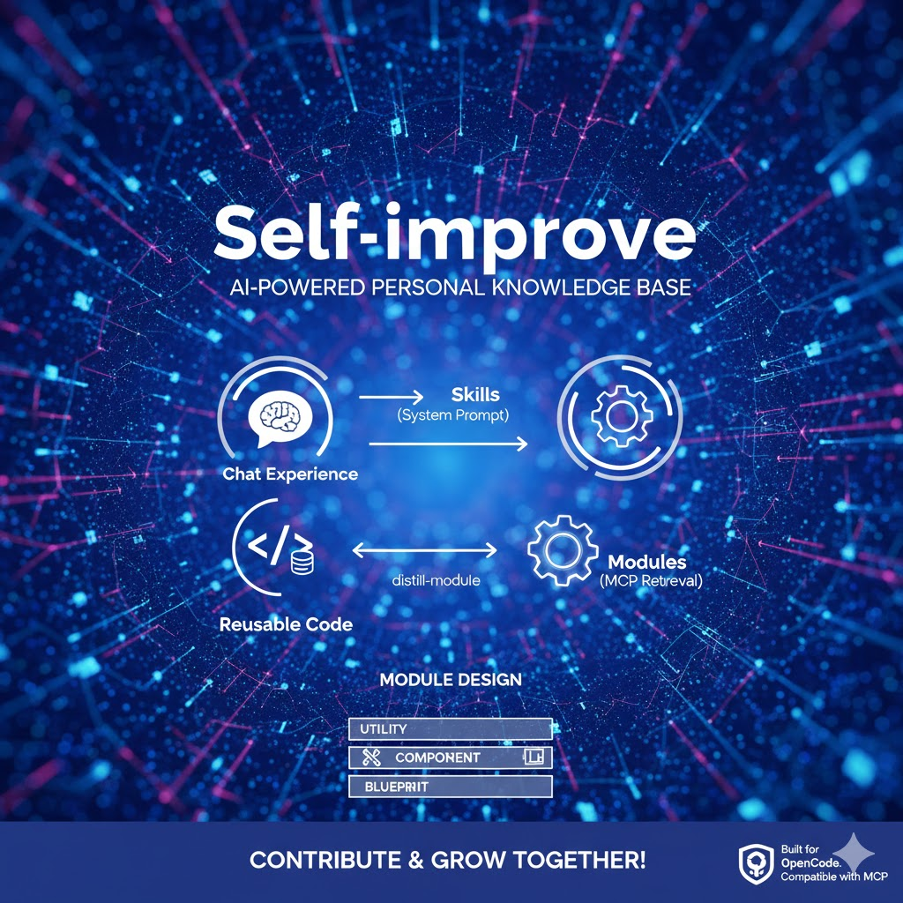

# Self-Improve

> AI Agent 赋能的个人知识库 —— 让每次对话都有积累，而不是从零开始。


## 为什么做这个

用 AI 编程工具（Claude Code、OpenCode 等）时，有个很明显的痛点：**每次对话都是一次性的**。你踩过的坑、总结的经验、写过的好用工具函数，下次对话全部归零。

这种「原地踏步」的感觉很强烈 —— 你在进步，但你的 AI 助手没有。

Self-Improve 要解决的就是这个问题：**把对话中的经验和代码沉淀下来，让 AI 助手越用越懂你。**

## 核心思路

两类知识，两条路径：

```
对话经验 ──→ /distill-skill ──→ Skills（注入 system prompt，自动匹配）
可复用代码 ──→ /distill-module ──→ Modules（MCP 按需检索，零上下文开销）
```

**Skills** 是经验型知识 —— 「FastAPI 异常处理应该这样设计」「React 表单校验的最佳实践」。通过 OpenCode 的 skill 机制加载到 system prompt，agent 自动匹配触发。

**Modules** 是代码型知识 —— 你封装好的 HTTP client、JWT 认证模块、项目脚手架。通过 MCP server 按需检索，agent 不读源码，只看 API，直接安装使用。像 npm/pip 一样，但是是你自己的私有包。

## 为什么不把代码模块也做成 Skill？

Skill 的 description 会全部注入 system prompt。10 个 skill 没问题，100 个代码模块的描述塞进去就是灾难 —— 上下文爆炸，互相污染，agent 反而更蠢。

所以代码模块走 MCP（Model Context Protocol）：agent 需要时主动调用 `search_modules` 检索，按需拉取，**零上下文开销**。

## 模块的三层设计

不是所有代码复用都是同一个粒度：

| 层级 | 说明 | 例子 | 使用方式 |
|------|------|------|----------|
| **utility** | 单文件工具函数 | HTTP client、日志封装 | 安装后直接 import |
| **component** | 多文件业务模块 | JWT 认证、权限管理 | 安装后按适配点修改 |
| **blueprint** | 项目架构模板 | FastAPI 后端骨架 | 不安装，agent 按蓝图生成 |

## 仓库结构

```
self-improve/
├── AGENTS.md              # agent 指令（sync 时注入 opencode 全局）
├── registry.json          # 模块索引（MCP server 读取）
├── skills/                # 经验型知识（按分类组织）
│   └── general/           # 通用技能
│       └── mermaid-diagram-generator/
├── modules/               # 代码模块（通过 /distill-module 添加）
│   ├── utilities/         # 工具函数
│   ├── components/        # 业务模块
│   └── blueprints/        # 架构模板
├── mcp-server/            # 模块检索 MCP 服务
│   └── server.py
└── commands/
    ├── sync.sh            # 一键注册到 opencode
    ├── register.py        # 注册模块到 registry
    ├── commit.md          # /commit 命令
    ├── distill-skill.md   # /distill-skill 命令
    └── distill-module.md  # /distill-module 命令
```

## 快速开始

### 1. 克隆仓库

```bash
git clone <your-repo-url>
cd self-improve
```

### 2. 安装 MCP 依赖

```bash
pip install mcp
```

### 3. 注册 MCP Server

编辑 `~/.config/opencode/opencode.json`，添加：

```json
{
  "mcp": {
    "self-improve-modules": {
      "type": "local",
      "command": ["python", "/你的路径/self-improve/mcp-server/server.py"],
      "enabled": true
    }
  }
}
```

### 4. 一键同步到 OpenCode

```bash
bash commands/sync.sh
```

这会自动完成：
- 注入 AGENTS.md 到 opencode 全局配置（动态写入仓库绝对路径）
- 链接所有 skills 到 opencode skills 目录
- 链接所有 commands（`/commit`、`/distill-skill`、`/distill-module`）

## 日常使用

### 提交代码

```
/commit
```

agent 会加载 git-master skill，自动检测仓库 commit 风格，按原子拆分规则执行规范的 commit。

### 蒸馏经验

对话结束时，觉得有值得沉淀的经验：

```
/distill-skill
```

agent 会分析对话，提取可复用经验，生成 SKILL.md 草稿供你确认后写入仓库。

### 蒸馏代码模块

写了个好用的工具函数或业务模块：

```
/distill-module
```

agent 会提取代码，生成 manifest.json（API 定义），注册到 registry。

### 使用模块

下次对话中，agent 会自动通过 MCP 检索你的模块库：

```
你：帮我写个需要 HTTP 请求的功能
agent：（自动调用 search_modules("http")）
      → 发现 http-client 模块
      → 调用 get_module_api("http-client") 查看 API
      → 调用 install_module("http-client", "./lib") 安装
      → 直接 import 使用
```

## 参与贡献

这个项目的核心价值在于**社区共建** —— 每个人的经验和代码模块都能让所有人受益。

### 贡献 Skill

1. Fork 本仓库
2. 在 `skills/<category>/` 下创建你的 skill 目录
3. 编写 `SKILL.md`，格式参考已有 skill
4. 提交 PR

### 贡献 Module

1. Fork 本仓库
2. 在 `modules/<type>/<lang>/<name>/` 下创建模块目录（所有类型统一包含 lang 层，跨语言模板用 `shared`）
3. 编写 `manifest.json` + `src/` 源码
4. 运行 `python commands/register.py <模块路径>` 注册
5. 提交 PR

### Manifest 规范

模块的 `manifest.json` 必须包含：

```json
{
  "name": "模块名（kebab-case）",
  "type": "utility | component | blueprint",
  "lang": "python | typescript | shared",
  "summary": "一句话描述，用于语义搜索",
  "tags": ["精准关键词", "用于标签匹配"],
  "install": {
    "dependencies": ["第三方依赖"],
    "entry": "from lib.xxx import Xxx"
  },
  "api": { }
}
```

## 技术栈

- **MCP Server**: Python，通过 stdio 与 agent 通信
- **Skills**: Markdown + YAML frontmatter，OpenCode 原生 skill 机制
- **Commands**: OpenCode slash command 格式
- **管理**: Git 版本控制，bash 脚本一键同步

## 兼容性

目前主要适配 [OpenCode](https://opencode.ai) + [oh-my-opencode](https://github.com/code-yeongyu/oh-my-opencode)。

MCP server 遵循标准 MCP 协议，理论上兼容所有支持 MCP 的 AI 编程工具（Claude Code 等）。Skills 部分需要根据不同工具的 skill 加载机制做适配。

## License

MIT
