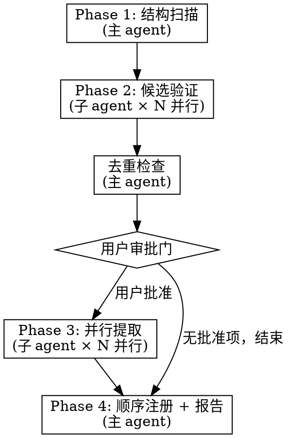

# Harvest Modules

从外部仓库中识别、验证、提取可复用代码模块，注册到知识库。

通过 4 阶段流水线处理大型仓库：结构扫描 → 候选验证 → 用户审批 → 并行提取。每个阶段控制上下文范围，避免大仓库撑爆上下文窗口。

## When to Use

- 有一个外部仓库，想把其中可复用的代码提取到知识库
- 仓库较大，不适合在单个对话中手动分析
- 想批量识别和提取多个模块

**不要用于：**
- 从当前对话提取代码 → 用 `/distill-module`
- 单个已知模块的提取 → 直接手动创建 manifest + 注册

## The Pipeline



## Phase 1: 结构扫描（主 agent 直接执行）

**目标：** 不读代码，只通过文件结构识别候选模块。

1. 确定仓库路径（本地路径或 `git clone --depth 1` 到临时目录）
2. 扫描目录结构：`tree` / `glob` / `ls`
3. 读取项目配置：`package.json`、`pyproject.toml`、`setup.py` 等
4. 按启发式规则识别候选（详见 `./scanner-heuristics.md`）

**输出格式：**

```
candidate_list = [
  {path: "src/utils/http-client.ts", reason: "自包含工具文件", estimated_type: "utility", lang: "typescript"},
  {path: "src/auth/", reason: "独立业务模块目录", estimated_type: "component", lang: "typescript"},
  ...
]
```

**注意：** 这一步只做文件名/路径级别的分析，不读源码。快速且适用于任何大小的仓库。

## Phase 2: 候选验证（子 agent 并行）

对每个候选（或相关候选的小集群），派发一个验证子 agent。

**使用 `dispatching-parallel-agents` 模式：**

```
task(
  category="deep",
  load_skills=[],
  run_in_background=true,
  description="验证候选模块: {candidate.path}",
  prompt=<使用 ./validator-prompt.md 模板填充>
)
```

每个子 agent 只读候选文件（通常 1-5 个），评估：
- 是否可泛化（还是太业务特定）
- 模块边界在哪里（哪些文件属于这个模块）
- API 表面是什么
- 依赖了什么

**收集结果后，主 agent 汇总验证报告。**

## 去重检查（主 agent 执行）

对每个通过验证的候选，调用 `search_modules()` 检查知识库：

| 情况 | 标记 |
|------|------|
| 无匹配 | ✅ 新模块 |
| 部分重叠 | ⚠️ 标注已有模块名和差异 |
| 高度重叠 | ❌ 建议跳过（用户可覆盖） |

## 用户审批门（唯一交互点）

将验证结果 + 去重结果合并展示给用户：

```
从 repo-name 识别到以下候选模块：

✅ date-utils (utility/ts) — 日期格式化工具集
✅ csv-parser (utility/py) — CSV 流式解析器
⚠️ auth-middleware (component/py) — 与现有 fastapi-jwt-auth 部分重叠
   差异：新增 OAuth2 支持、rate limiting
❌ user-service (跳过) — 业务特定，不可复用
❌ main-app (跳过) — 应用入口，不可复用

请确认要提取哪些模块（可修改名称/类型）：
```

用户可以：
- 批准/拒绝单个候选
- 修改模块名称或类型
- 对 ⚠️ 项决定：创建新模块 / 替换旧模块 / 跳过

**只设这一个交互门。** 提取阶段是机械性工作，不需要再次确认。

## Phase 3: 并行提取（子 agent 并行）

对每个批准的模块，派发一个提取子 agent。

```
task(
  category="unspecified-low",
  load_skills=[],
  run_in_background=true,
  description="提取模块: {module.name}",
  prompt=<使用 ./extractor-prompt.md 模板填充>
)
```

每个子 agent：
1. 读取源文件
2. 泛化代码（移除业务特定引用，提取 adapt_points）
3. 生成 `manifest.json`
4. 写入 `modules/<type>/<lang>/<name>/manifest.json` 和 `src/`
5. **不运行 register.py**（避免并发写入 registry.json）

## Phase 4: 顺序注册 + 报告（主 agent）

所有提取完成后：

1. 逐个运行 `python __REPO_PATH__/commands/register.py modules/<type>/<lang>/<name>`
2. 输出最终报告：

```
从 repo-name 收割了 N 个模块：

✅ date-utils (utility/typescript) — 已注册
✅ csv-parser (utility/python) — 已注册
✅ auth-middleware (component/python) — 已替换 fastapi-jwt-auth
```

## 关键约束

- **Phase 1 不读源码** — 只看文件结构，保证对大仓库也能快速完成
- **子 agent 只读候选文件** — 不读整个仓库，控制上下文大小
- **注册必须顺序执行** — 避免并发写 registry.json 冲突
- **一个用户交互门** — 不要在每个模块提取后再问一次

## 常见错误

| 错误 | 正确做法 |
|------|----------|
| 试图在一个上下文中读完整个仓库 | Phase 1 只看结构，Phase 2 子 agent 只读候选文件 |
| 跳过去重检查 | 知识库膨胀比缺少模块更有害 |
| 并行运行 register.py | 顺序执行，避免 registry.json 写入冲突 |
| 每个模块提取后都问用户 | 只在审批门交互一次 |
| 把业务代码原样复制 | 必须泛化：移除硬编码、提取 adapt_points |

## 相关资源

- **REQUIRED:** `self-improve/dispatching-parallel-agents` — 并行子 agent 调度模式
- `./scanner-heuristics.md` — Phase 1 启发式扫描规则
- `./validator-prompt.md` — Phase 2 子 agent 提示词模板
- `./extractor-prompt.md` — Phase 3 子 agent 提示词模板
- `/distill-module` 命令 — manifest.json schema 参考
